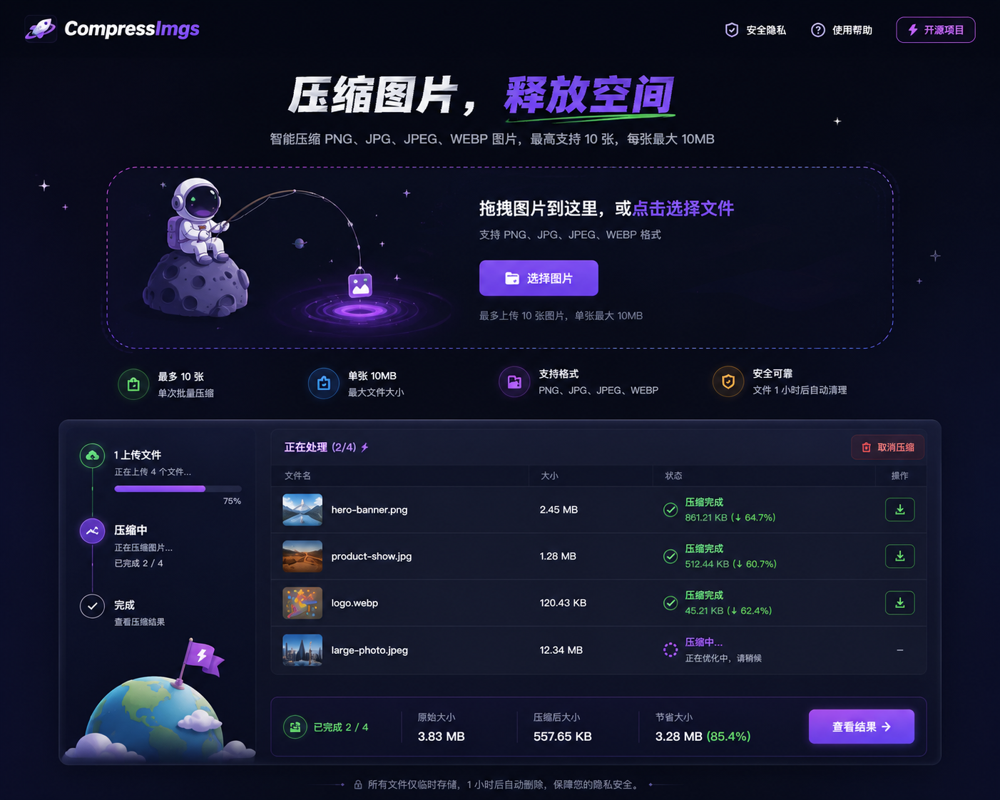

# CompressImgs

一个基于 `FastAPI + Jinja2` 的图片压缩 MVP，目标是快速做出类似 TinyPNG 的单机低并发版本。



## 功能

- 支持拖拽上传和点击选择文件
- 支持 `PNG`、`JPG`、`JPEG`、`WEBP`
- 单次最多上传 `10` 张图片
- 单张最大 `10 MB`
- 支持上传进度、压缩进度和结果页展示
- 支持单图下载
- 成功图片不少于 `2` 张时支持 `ZIP` 下载
- 优先使用 `Tinify`
- 未配置 `TINIFY_API_KEY` 时可回退到本地压缩流程，方便开发联调

## 技术栈

- `FastAPI`
- `Jinja2Templates`
- 原生 `JavaScript`
- `CSS`
- `tinify`
- `Pillow`

## 快速启动

### 1. 安装依赖

```bash
pip install -r requirements.txt
```

### 2. 配置环境变量

复制 `.env.example` 为 `.env`，按需填写：

```env
TINIFY_API_KEY=
MAX_FILES_PER_UPLOAD=10
MAX_FILE_SIZE_MB=10
MAX_REQUEST_SIZE_MB=100
TEMP_DIR=work/tmp
FILE_EXPIRE_MINUTES=30
POLL_INTERVAL_MS=2500
RATE_LIMIT_PER_MINUTE=5
```

运行时文件会集中存放在 `TEMP_DIR/runtime/` 下，例如：

```text
work/tmp/runtime/
  uploads/
  compressed/
  zips/
  tasks/
```

### 3. 启动项目

Windows 下可直接执行：

```bat
start.bat
```

或手动启动：

```bash
python -m uvicorn app.main:app --host 127.0.0.1 --port 8000 --reload
```

启动后访问：

```text
http://127.0.0.1:8000
```

## 目录结构

```text
app/
  main.py
  config.py
  routes/
  services/
  templates/
  static/
    css/
    js/
  models/
assets/
work/
  tmp/
    runtime/
      uploads/
      compressed/
      zips/
      tasks/
requirements.txt
start.bat
```

## 开发说明

- `app/static/css/app.css` 是当前样式维护文件，直接修改它
- 当前实现以 MVP 为主，优先保证可运行和可迭代
- 中屏和移动端已做基础适配，避免内容被硬挤压变形

## 路线

- 继续提升首页与设计稿的像素级还原
- 完善异常态、空态和上传失败提示
- 继续整理样式结构，控制页面复杂度

## License

本项目基于 `MIT` 协议开源，详见 [LICENSE](./LICENSE)。
